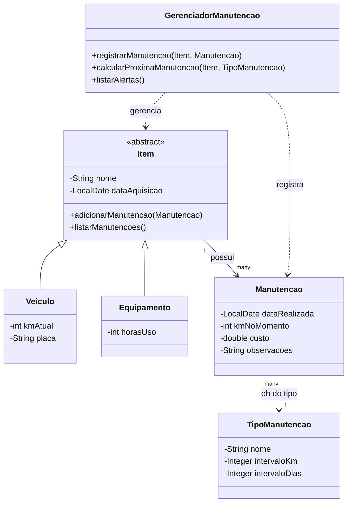

# Gerenciador de Manutenção de Equipamentos e Veículos

Sistema em Java para cadastro de veículos e equipamentos, registro de manutenções e geração automática de alertas com base em quilometragem e/ou tempo decorrido.

## Sobre o projeto

Manter carros, motos e equipamentos em dia costuma depender da memória do dono ou de planilhas soltas. Este projeto resolve isso de forma programática: você cadastra seus itens, registra as manutenções feitas e o sistema calcula automaticamente quando a próxima está prevista, alertando quando ela se aproxima ou já está atrasada.

Projeto desenvolvido como exercício prático de **Programação Orientada a Objetos** em Java, aplicando herança, abstração e separação de responsabilidades (model / service / repository).

## Funcionalidades

- Cadastro, edição e remoção de itens (veículos ou equipamentos)
- Registro de manutenções com data, km, custo e observações
- Definição de regras de recorrência por tipo de manutenção (ex: troca de óleo a cada 5.000 km ou 6 meses)
- Cálculo automático da próxima manutenção prevista
- Sistema de alertas com status: `OK` / `Atenção` / `Atrasada`
- Relatório de gastos por item e por período

## Diagrama de classes



## Estrutura do projeto

```
src/
├── model/
│   ├── Item.java
│   ├── Veiculo.java
│   ├── Equipamento.java
│   ├── TipoManutencao.java
│   └── Manutencao.java
├── service/
│   └── GerenciadorManutencao.java
├── repository/
│   └── ItemRepository.java
└── ui/
    └── Main.java
```

## Como executar

```bash
git clone https://github.com/seu-usuario/gerenciador-manutencao.git
cd gerenciador-manutencao
javac -d bin src/**/*.java
java -cp bin ui.Main
```

> Pré-requisito: JDK 17 ou superior instalado.

## Tecnologias utilizadas

- Java (POO)
- Interface via terminal (CLI)
- Persistência em arquivo (JSON/CSV) *(em desenvolvimento)*

## Roadmap

- [ ] Modelagem de classes (Item, Veiculo, Equipamento, Manutencao, TipoManutencao)
- [ ] Cadastro e listagem de itens em memória
- [ ] Registro de manutenções vinculado a um item
- [ ] Cálculo de próxima manutenção prevista
- [ ] Exibição de alertas no console
- [ ] Persistência em arquivo JSON
- [ ] Relatórios de gastos


## Autor

Feito por **Pedro Lima** — sinta-se à vontade para abrir issues, sugerir melhorias ou contribuir com pull requests.
